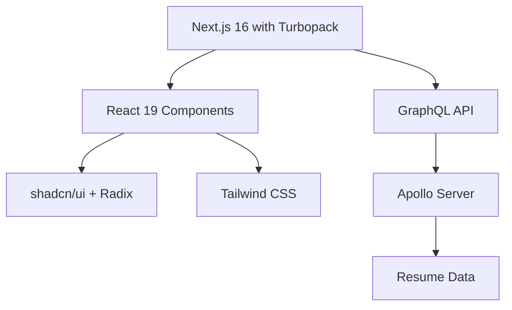

<div align="center">

# 💼 André Gomes

### Digital Resume & Professional Portfolio

*A modern, interactive CV built for the web*

[](https://nextjs.org/)
[](https://react.dev/)
[](https://www.typescriptlang.org/)
[](https://tailwindcss.com/)
[](https://graphql.org/)
[](https://www.docker.com/)
[](https://nodejs.org/)

[View Live](https://andrenevesgomes.is-a.dev) • [Download PDF](#)

</div>

---

## 🎯 Overview

This is my **personal CV/Resume** presented as a modern web application. Instead of a static PDF, I've built an interactive, responsive, and print-optimized digital resume that showcases both my professional experience and technical capabilities.

**Why a web-based CV?**
- 🌐 **Always Accessible** - Share a single link that's always up-to-date
- 📱 **Multi-Device Optimized** - Perfect viewing experience on any screen
- 🖨️ **Print-Ready** - Generates a perfect PDF when you need it
- ⚡ **Lightning Fast** - Optimized performance and Core Web Vitals
- 🖥️ **SEO Optimized** - Discoverable and indexable by search engines
- 🎨 **Professional Design** - Clean, minimalist, and focused on content

## ⚡ Key Features

### For Viewers
- **🎯 Instant Navigation** - Press `Cmd/Ctrl + K` for quick section jumping
- **📱 Responsive Design** - Optimized for mobile, tablet, and desktop
- **🖨️ Print Perfect** - One-click printing with professional formatting
- **🌙 Clean Interface** - Distraction-free reading experience

### For Developers
- **📊 GraphQL API** - Programmatic access to resume data at `/graphql`
- **📝 Single Source of Truth** - All content in one configuration file
- **🔄 Auto-Generated Sitemap** - SEO-optimized structure
- **🎨 Highly Customizable** - Tailwind CSS + shadcn/ui components
- **🐳 Docker Ready** - Containerized for easy deployment

## 🏗️ Architecture



### Built With

| Category | Technology |
|----------|-----------|
| **Framework** | Next.js 16 with App Router & Turbopack |
| **Frontend** | React 19 |
| **Language** | TypeScript 5.9 |
| **Styling** | Tailwind CSS 3.4 |
| **UI Library** | shadcn/ui (Radix UI primitives) |
| **API** | GraphQL with Apollo Server 4 |
| **Build Tool** | Turbopack (Next.js native) |
| **Deployment** | Vercel-optimized |
| **Container** | Docker & Docker Compose |

## 🚀 Quick Start

### Prerequisites
```bash
Node.js 20+ (compatible with v25)
pnpm 8+
```

> 💡 **Note**: This project uses Next.js 16 with Turbopack for faster builds and React 19 for improved performance.

### Local Development

```bash
# Install dependencies
pnpm install

# Run development server
pnpm dev

# Open http://localhost:3000
```

### Production Build

```bash
# Build for production
pnpm build

# Start production server
pnpm start
```

### Docker Deployment

```bash
# Using Docker Compose
docker compose up -d

# Or build manually
docker build -t cv-app .
docker run -p 3000:3000 cv-app
```

## 🚧 Project Structure

```
cv/
├── 📱 src/
│   ├── app/                    # Next.js App Router
│   │   ├── layout.tsx          # Root layout & metadata
│   │   ├── page.tsx            # Main CV page
│   │   ├── components/         # Page-specific components
│   │   └── graphql/            # GraphQL endpoint
│   ├── components/
│   │   ├── ui/                 # Reusable UI components
│   │   └── icons/              # Custom icon components
│   ├── data/
│   │   └── resume-data.tsx     # 📝 CV content (edit this!)
│   ├── lib/
│   │   ├── types.ts            # TypeScript definitions
│   │   └── utils.ts            # Utility functions
│   └── apollo/                 # GraphQL server setup
├── 🐳 docker-compose.yaml      # Container orchestration
├── 🎨 tailwind.config.js       # Styling configuration
└── 📦 package.json             # Dependencies
```

## 🎨 Customization Guide

### 1️⃣ Update Your Information

All CV content lives in **one file**:

```typescript
// src/data/resume-data.tsx
export const RESUME_DATA = {
  name: "André Gomes",
  initials: "AG",
  location: "Lisboa, Portugal, UTC+1",
  locationLink: "https://www.google.com/maps/place/lisboa",
  about: "Engineer passionate about building scalable solutions",
  summary: "Full Stack Engineer with X years of experience...",
  avatarUrl: "/avatar.jpg",
  personalWebsiteUrl: "https://yourdomain.com",
  contact: {
    email: "your@email.com",
    tel: "+351123456789",
    social: [...]
  },
  education: [...],
  work: [...],
  skills: [...],
  projects: [...]
}
```

### 2️⃣ Customize Styling

```bash
# Colors & Theme
tailwind.config.js

# Global Styles
src/app/globals.css

# Component Styles
src/components/ui/
```

### 3️⃣ Add Company Logos

```bash
# Place logos in
src/images/logos/

# Reference in resume-data.tsx
logo: CompanyLogo
```

## 🐳 Docker Deployment

### Using Docker Compose

```bash
# Build the container
docker compose build

# Run the container
docker compose up -d

# Stop the container
docker compose down
```

### Using Docker directly

```bash
# Build the image
docker build -t cv-app .

# Run the container
docker run -p 3000:3000 cv-app
```

## 🔧 Configuration

### Environment Variables

No environment variables are required for basic usage. The app works out of the box!


## 📄 License

This project is licensed under the MIT License - see the [LICENSE](LICENSE) file for details.

---

<div align="center">

### 💡 Inspiration

*Built with the [minimalist CV template](https://github.com/BartoszJarocki/cv) foundation, customized and deployed as a personal project.*

**Stack**: Next.js 16 • React 19 • TypeScript 5.9 • Tailwind • GraphQL • Docker

Made with ☕ by André Gomes

</div>